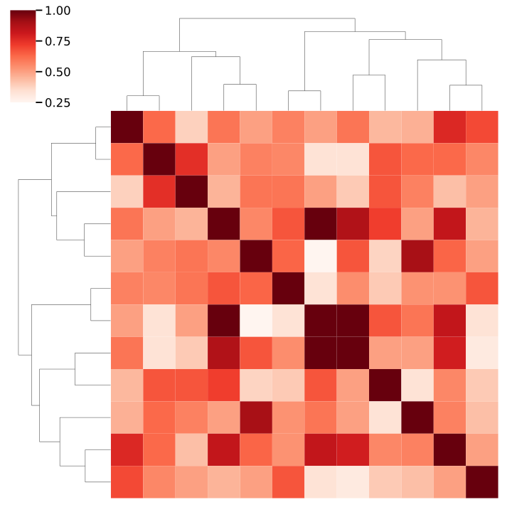
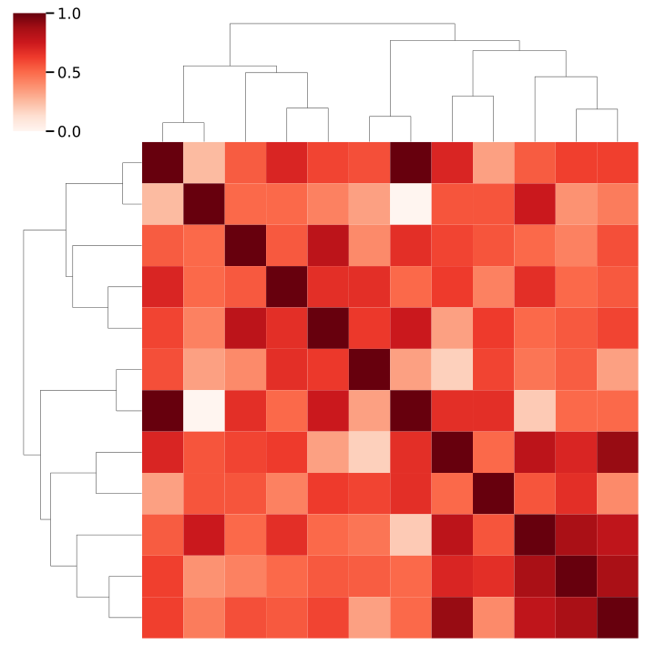

<!-- _paginate: false -->

<!--  -->

# Le Tournoi des Croissants 2024

##### Ben Pedigo

(he/him)
Croissant Analyst II
Allen Institute for Pastry Science

 [ben.pedigo@alleninstitute.org](mailto:ben.pedigo@alleninstitute.org)
 [@bdpedigo (Github)](https://github.com/bdpedigo)
 [@bpedigod (Twitter)](https://twitter.com/bpedigod)
 [bdpedigo.github.io](https://bdpedigo.github.io/)

---

# By the numbers

- 18 bakeries
- 16 weeks
- 180 croissants ranked

---

---

# Voter-voter agreement

$*$ only computed for >= 5 votes

---

# Null voting model

- Preserve overall preference for each bakery at each week
- Randomize votes among voters that were present at that week

---

# Null suggests no significant agreement

---

# Do you know your bestie?

$*$ only computed for >= 5 votes

Ben's bestie is Derrick (agreement 0.83)
Bethanny's bestie is Xiaoyu (agreement 0.75)
Forrest's bestie is Rachael (agreement 0.83)
Jenna's bestie is Rachael (agreement 0.83)
Kim's bestie is Jenna (agreement 0.79)
Marc's bestie is Xiaoyu (agreement 0.88)
Nuno's bestie is Rachael (agreement 0.80)
Chi's bestie is Nuno (agreement 0.78)
Keith's bestie is Kim (agreement 0.70)
Cameron's bestie is Rachael (agreement 0.80)
Xiaoyu's bestie is Marc (agreement 0.88)
Rachael's bestie is Marc (agreement 0.86)
Derrick's bestie is Ben (agreement 0.83)

---

# Croissant preference space

---

# Are you a tastemaker?

Proportion of "correct" votes

Jenna       0.866667
Rachael     0.857143
Nuno        0.750000
Forrest     0.733333
Kim         0.733333
Cameron     0.700000
Ben         0.687500
Derrick     0.666667
Marc        0.642857
Xiaoyu      0.555556
Chi         0.545455
Keith       0.545455
Bethanny    0.533333

